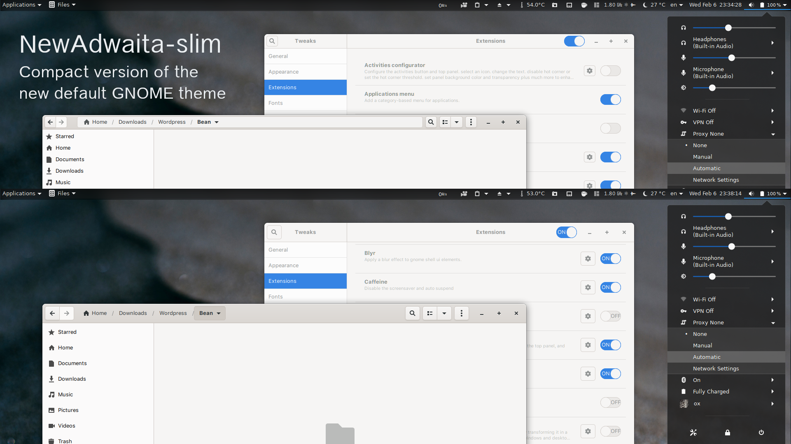

# NewAdwaita-slim
Tweak New Adwaita GTK Theme with slim version

<ul>
<b>GTK2/3</b>
<li>NewAdwaita slim.</li>
<li>Fix pathbar.</li>
<li>Tweak clean widget.</li>
</ul>

## Preview

## Installation
<ul>
<li>Just unzip the file and place it in your themes directory i.e. ~/.themes/ or /usr/share/themes/</li>
<li>Install gnome-tweak-tool</li>
sudo apt install gnome-tweak-tool</li>
<li>Select the theme as 'NewAdwaita-slim</li>
</ul>

## Download
[Latest release here](NewAdwaita-slim.tar.xz) also over at [GNOME-Look](https://www.opendesktop.org/p/1288797/).

## Original projects
- https://download.gnome.org/misc/testing/Adwaita/
